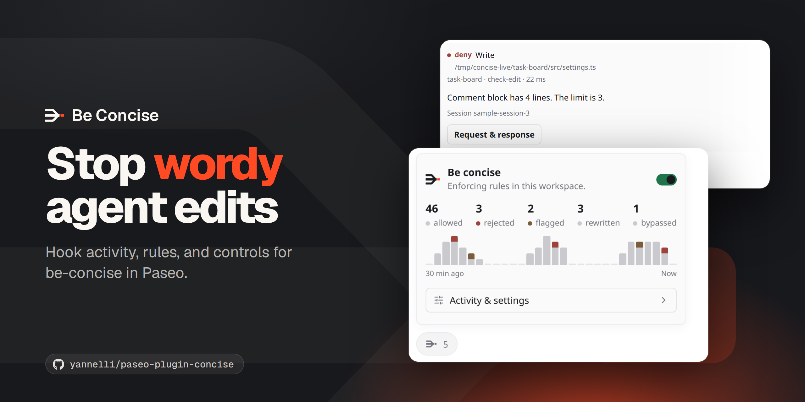

# Be concise for Paseo

A native companion to [be-concise](https://github.com/yannelli/be-concise) for Claude Code and Codex. Open **Be concise** in Paseo's sidebar, workspace panels, or Command Center. The composer pill shows the rejected and flagged total when enforcement is on and **Off** when disabled. Open it for decision details and the workspace enforcement toggle.

- Live hook decisions, searchable by tool, file, session, project, and reason. Pause the feed or open an event’s request and response.
- A compact composer pill with the Be concise logo and one number. The number combines rejected and flagged decisions; the popup shows each decision count and a 30-minute chart. Turning enforcement off displays **Off** and sets the workspace's `softFail` override; flagged actions are allowed while hooks and test-output filtering remain active. Turn it on to restore enforcement. Agent environment overrides apply separately.
- Call counts, interventions, sessions, average hook duration, and a 30-minute activity chart.
- User and project configuration with threshold controls, check switches, writing presets, an advanced JSON editor, and test filter settings.
- An isolated playground for file writes, Codex patches, shell commands, and final replies. Previews inspect hook responses without executing the pasted command or writing the target file.

## Screenshots

All images are 1920×1080. They come from the Paseo 0.11.0-beta.3 web app in light mode with this plugin installed, using sample activity on a separate test daemon. The first five frame real captures with a headline. See [capture details](docs/composer-pill.md#screenshots).

### Composer pill

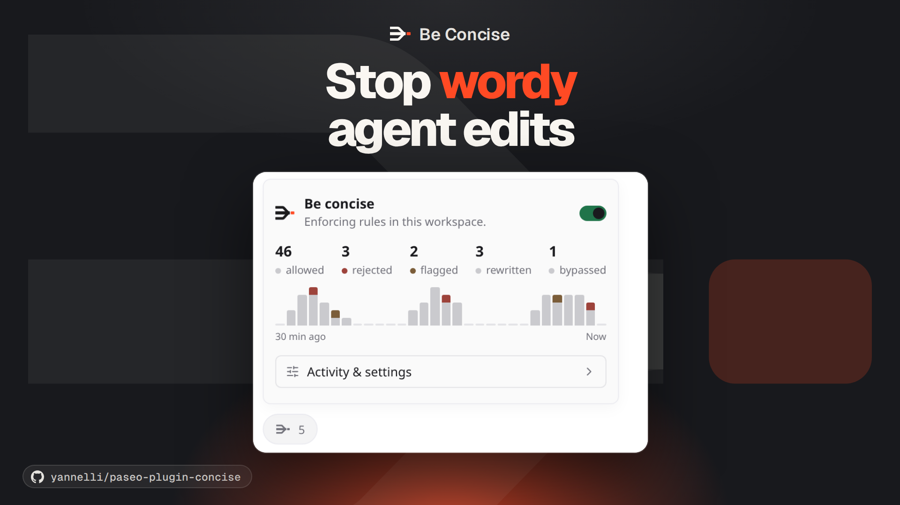

### Live activity

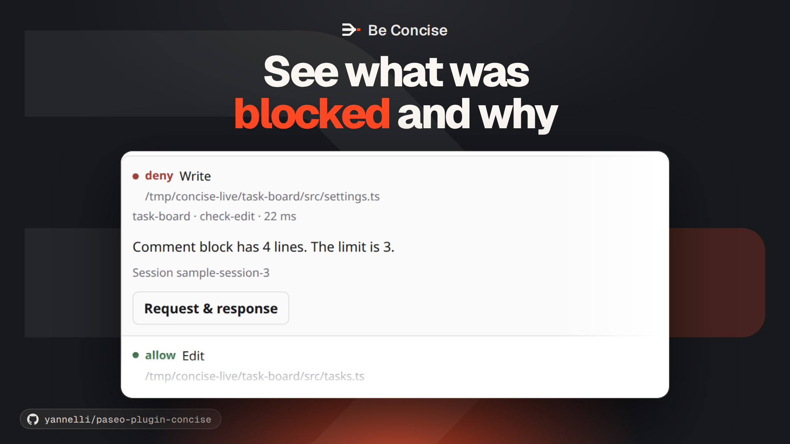

### Configuration

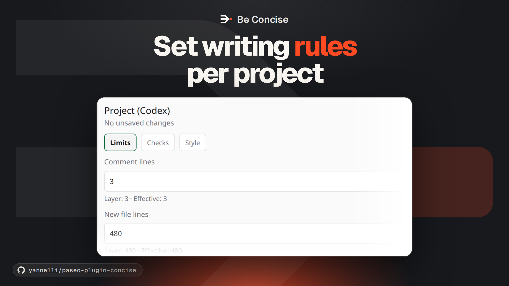

### Hook preview

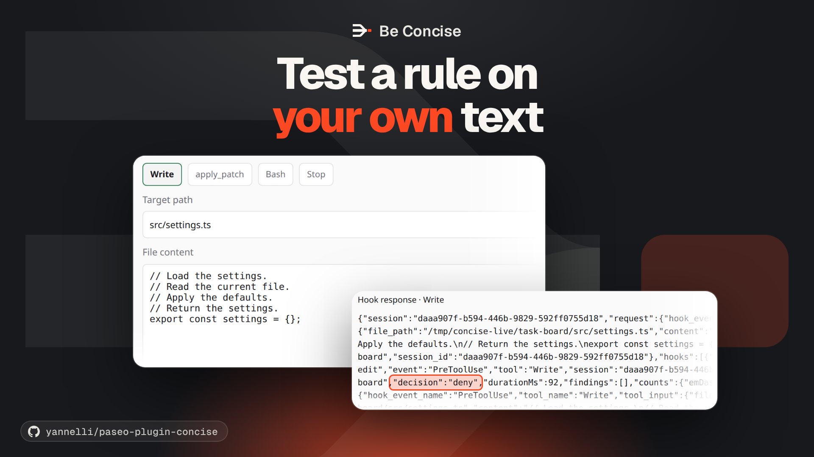

### Narrow screens

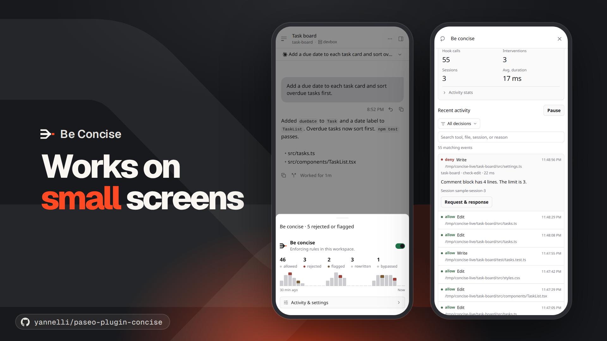

### Enforcement off

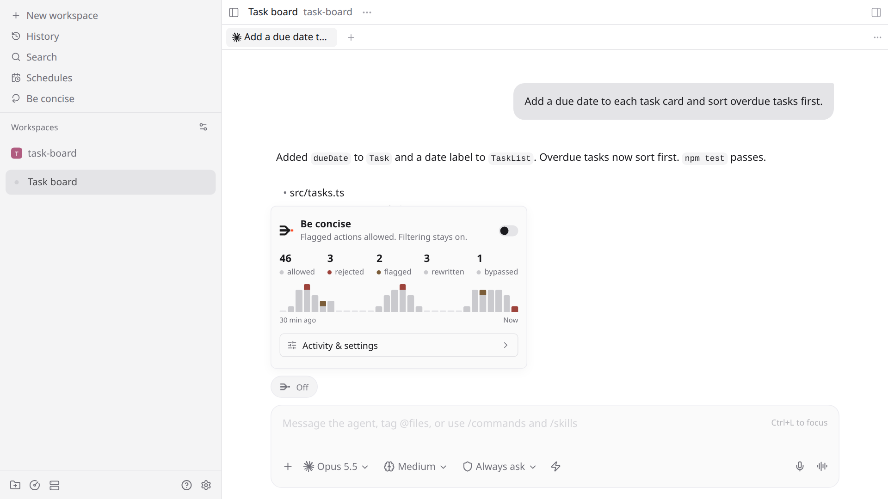

### Paused and filtered activity

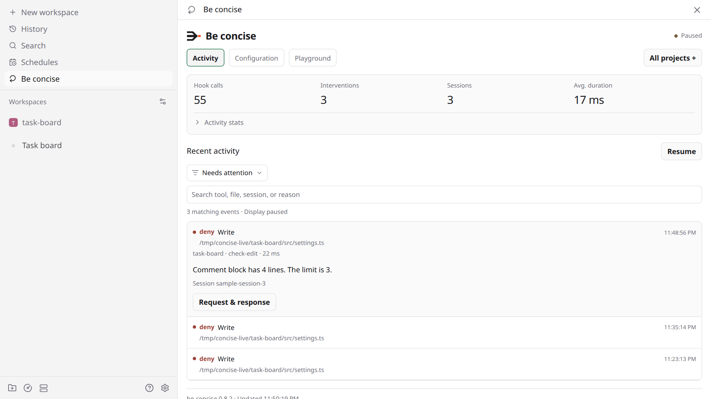

<details>
<summary>Connection and empty states</summary>

### Connecting

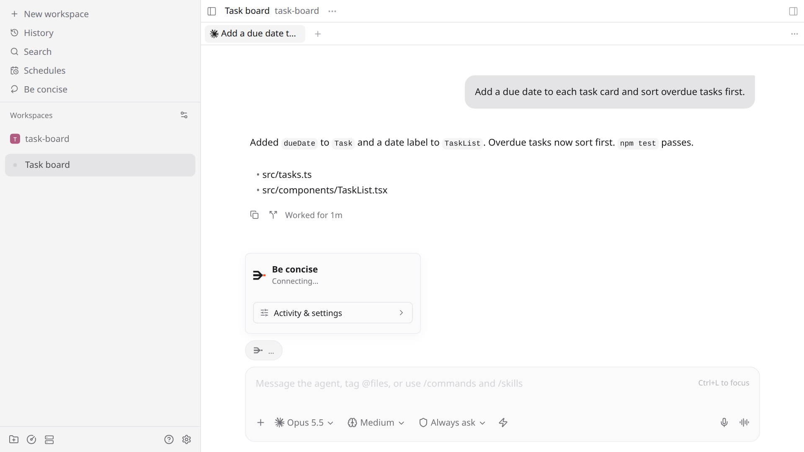

### Unavailable

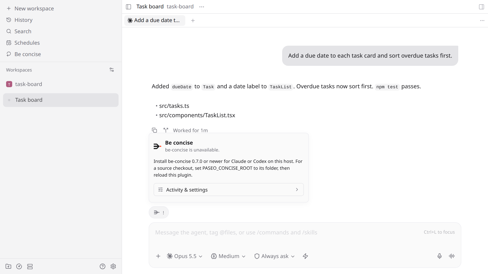

### No activity

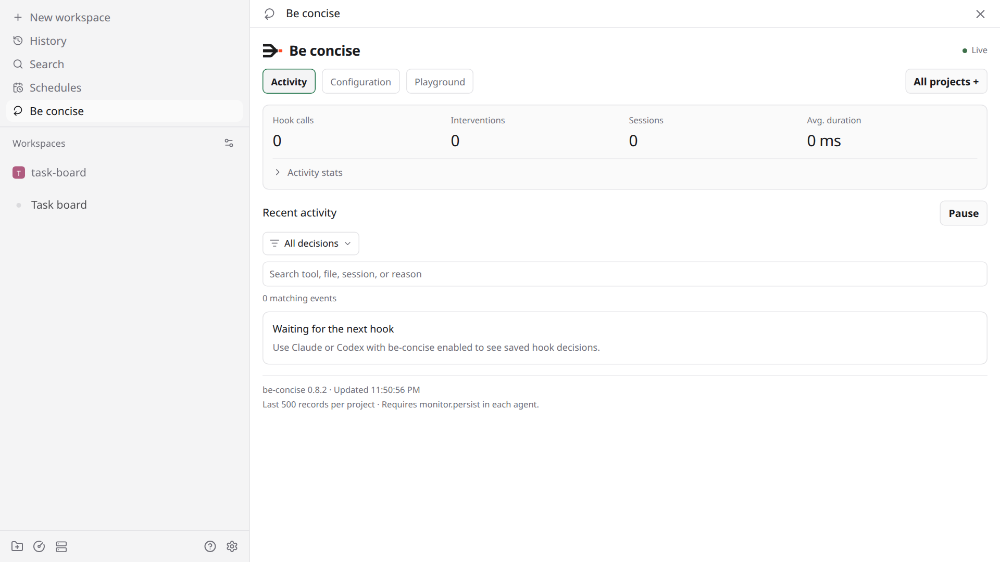

</details>

## Install

Requires Paseo 0.9.0 or newer (tested against the 0.10.2 plugin SDK) and be-concise 0.7.0 or newer on the daemon machine. The adapter uses the configuration, monitoring, and preview APIs shipped with be-concise 0.7.0. Paseo supplies all runtime dependencies.

```sh
paseo plugin add yannelli/paseo-plugin-concise
paseo plugin ls
```

For local development:

```sh
git clone https://github.com/yannelli/paseo-plugin-concise.git
cd paseo-plugin-concise
npm ci
npm run check
paseo plugin install "$PWD"
paseo plugin ls
```

Plugins must be enabled in Paseo Settings → Plugins. Installation runs trusted code with the daemon user’s access.

The plugin detects installed be-concise versions in the Claude and Codex caches, respecting `CLAUDE_CONFIG_DIR` and `CODEX_HOME`. For a source checkout or custom installation, set `PASEO_CONCISE_ROOT` in the daemon environment to the repository or `plugins/concise` directory, then reload this plugin.

## Activity and settings

The view refreshes every two seconds. It follows the project registry and saved records under the daemon’s HOME/XDG directories, alongside any running `concise-web` console. It retains up to 500 events per project within a shared 16 MiB budget. Stats describe that retained window; they are not lifetime totals. New activity requires `monitor.persist` to be enabled and `BEC_MONITOR_DISABLED` to be unset in the agent’s environment.

Configuration controls edit the selected file and preserve its other keys. **Save changes** validates through be-concise and checks the file revision. An intervening edit preserves your draft and requires an explicit reload. The effective view uses the daemon’s environment; agent-specific environment overrides apply separately. The interface labels active and inactive layers because creating a higher-priority file changes which configuration is selected.

Each preview starts with separate retry state. Preview results do not enter live activity. The plugin does not modify the Claude or Codex installation or start another web console.

## Development

```sh
npm run check
paseo plugin reload paseo-be-concise
paseo plugin logs paseo-be-concise
```

Tests use Node.js 24 and temporary home/project directories. They cover activity normalization, retention, stats, installation discovery, config conflicts, file permissions, and preview isolation. Integration tests require an installed be-concise; set `PASEO_CONCISE_ROOT` to a checkout to select it explicitly.

Paseo API reference: [v0.9 plugins](https://paseo.sh/docs/plugins/v0.9/reference).

See the [documentation index](docs/INDEX.md) for the current composer button contract and screenshot capture details. Consult it when changing pill labels or updating screenshots.

## Releases

GitHub Actions runs the checks and publishes a GitHub release on qualifying pushes to `main`. The first release is `v0.1.0`. The workflow updates `package.json` and `package-lock.json`, pushes an annotated tag, and publishes release notes. It uses the repository's `GITHUB_TOKEN`; no extra secrets or npm publication are required.

Use Conventional Commits in commits and squash-merge titles:

| Commit | Version change |
| --- | --- |
| `fix:`, `perf:`, `revert:` | Patch |
| `feat:` | Minor |
| `!` after the type/scope, or a `BREAKING CHANGE:` footer | Major, including before 1.0 |
| `docs:`, `chore:`, `ci:`, and other types without a breaking marker | No release |

The highest change since the last release determines the next version. For example, `fix: repair the badge` changes `0.1.0` to `0.1.1`; `feat: add a filter` changes it to `0.2.0`.

Run `npm run release:dry-run` from a clean `main` checkout with all tags fetched to preview the next release. Rerun the **Release** workflow to complete a publication interrupted after its tag was pushed.

Questions or feedback? Please reach out to me at [Ryan Yannelli](https://ryanyannelli.com) or open an issue/PR.
